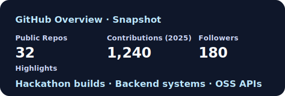
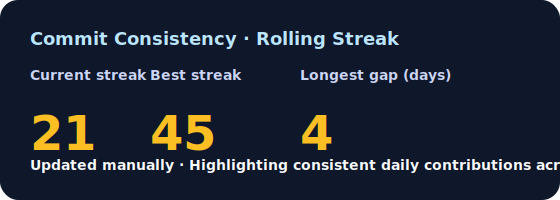
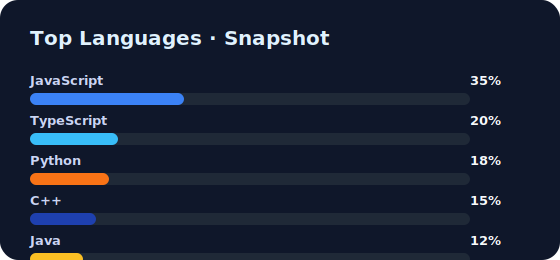

<!-- Animated Typing Header -->

  

---

<!-- Animated Divider -->

  

---

## 🤝 Connect

  
  

---

## 👨‍💻 About Me

🎓 **B.Tech Computer Science & Engineering Student**  
💻 **Full Stack Developer | Backend & Systems Focused | Learning AI/ML**  

I focus on **architecture-first development**, building systems that scale, fail gracefully, and deliver real value.  
Actively involved in **hackathons**, system-level projects, and continuous learning.

- 🔭 Backend & Full Stack projects (MERN)
- 🌱 Advanced Backend, Databases, ML Foundations
- 🧠 System Design, AI Governance, Large-Scale Systems
- 🏆 **SAKSHAM — Smart India Hackathon Project (NDMA Use-case)**
- 📈 DSA & problem-solving consistency

---

## 🏆 Hackathons & Key Projects

### 🆔 SAKSHAM — Smart India Hackathon (SIH)

**Problem Domain:** Disaster Management & Training Monitoring (NDMA)

**Key Features**
- Centralized data ingestion for field operations
- ML-based anomaly & trend detection
- Backend APIs with secure role-based access
- Automated, policy-ready PDF report generation

**Tech Stack**
`Node.js` · `Express` · `MongoDB` · `Python` · `Machine Learning`

---

### 🧭 Wanderlust — Travel Listing Platform

**Key Features**
- Map-based location discovery & search
- Image uploads with secure storage
- Authentication & authorization
- Scalable backend architecture

**Tech Stack**
`Node.js` · `Express` · `MongoDB` · `EJS` · `Mapbox` · `Cloudinary`

---

### 🔬 Aadhaar Intelligence System

**Key Features**
- Ensemble-based anomaly detection
- Trend & seasonal pattern analysis
- Governance-ready dashboards & reports
- Data-driven risk scoring

**Tech Stack**
`Python` · `Machine Learning` · `Node.js` · `NeonDB`

## 🛠 Tech Stack

### 💻 Languages

  
  
  
  
  
  

---

### 🎨 Frontend

  
  
  
  
  

---

### 🧩 Backend & Databases

  
  
  
  
  
  
  

---

### 🤖 AI / ML

  
  
  
  
  

---

### ☁️ Tools & Platforms

  
  
  
  
  
  
  
  
  

---

## 🌟 What I Bring to the Table

| 🚀 Domain | 💡 Focus | 🔍 Details |
|--------|--------|----------|
| 🤖 **AI Agents** | Intelligent automation | Generative and Agentic AI, Automation |
| 🌐 **Full-Stack** | End-to-end systems | Scalable backend-first architectures |
| 🔐 **Security** | Secure design mindset | Vulnerability analysis & best practices |
| 🔐 **Scalability** | Scalable Systems | End-to-End Approach using Caching etc. |
| ⚡ **Hackathons** | Proven execution | 10+ hackathons, pressure-tested delivery |

## 📊 GitHub Analytics

<!-- Contribution Graph -->

  

---

<!-- GitHub Stats + Streak -->

  
  

---

<!-- Languages -->

  

---

<!-- Profile Metrics -->

  
  
  

---

⭐ *Architecture first. Systems over shortcuts.*

